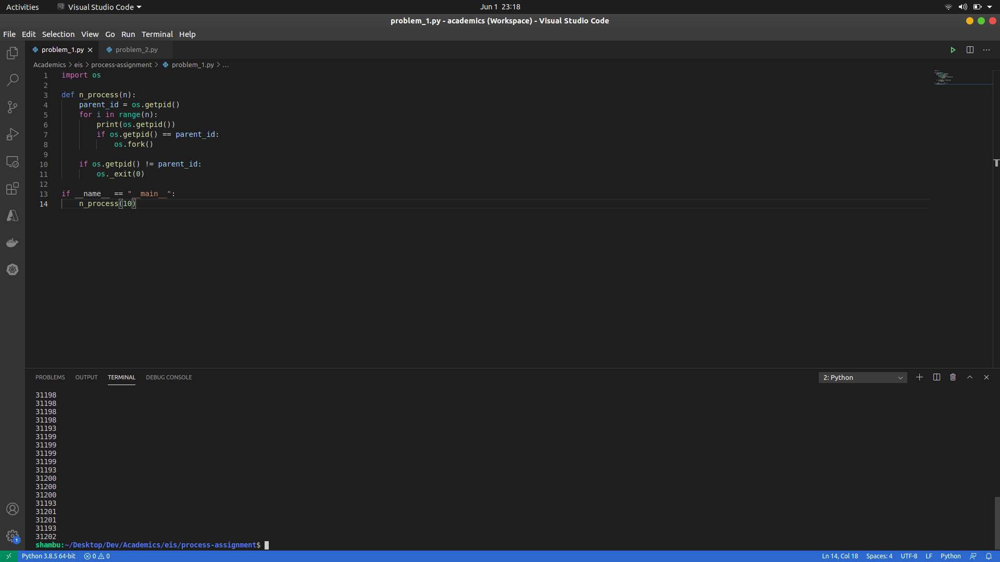
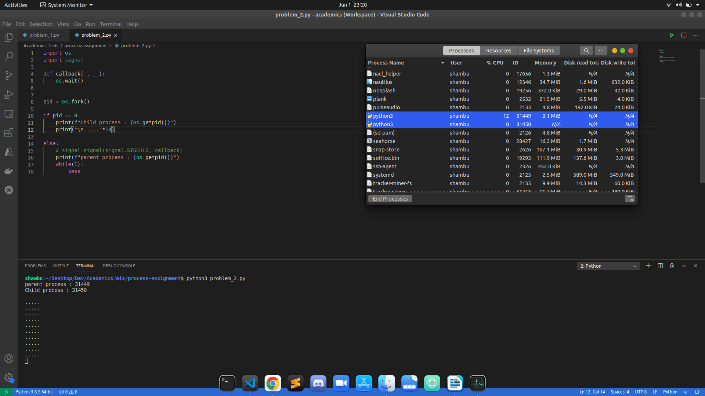
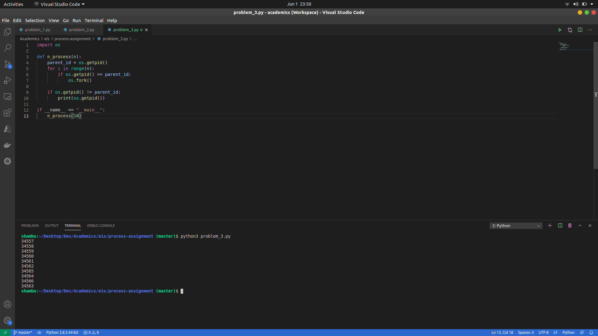

# EIS assignment

## Problem 1:
Write a program which will create n process. show that the processes will run asynchronously on CPU (i.e. there is no specific order in which the process are scheduled on the CPU).

## Problem 2:
Demonstrate the Creation of a Zombie process and also show that the zombie process can be prevented.

### A) Zombie process created:

### B) Zombie process is prevented:

## Problem 3:
Write a program which creates, say 10 process. Let them run in an infinite loop. show that the processes are scheduled on the CPU in no specific order.

