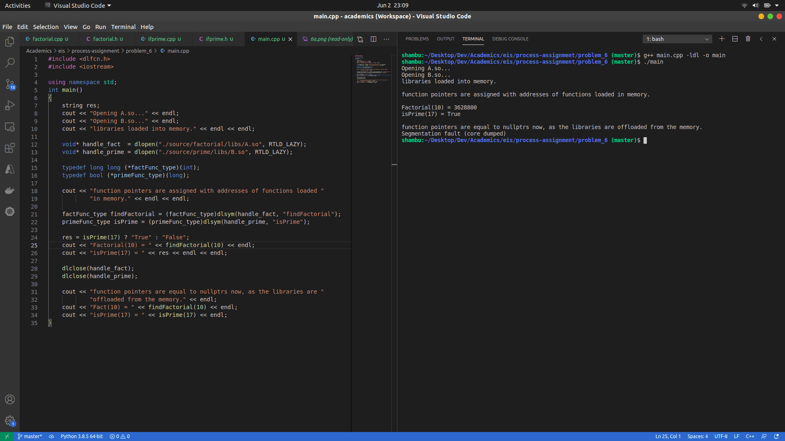

# EIS assignment

## Problem 1:
Write a program which will create n process. show that the processes will run asynchronously on CPU (i.e. there is no specific order in which the process are scheduled on the CPU).

 

## Problem 2:
Demonstrate the Creation of a Zombie process and also show that the zombie process can be prevented.

### A) Zombie process created:

 

### B) Zombie process is prevented:

 

## Problem 3:
Write a program which creates, say 10 process. Let them run in an infinite loop. show that the processes are scheduled on the CPU in no specific order.

 

## Problem 5:
Give a solution to the bounded buffer producer and consumer problem using semaphore. The buffer should implement in a shared memory. Producer and consumer should be two distinct processes. The buffer state at different times should be captured in a text file or in a graphical representation.

 

## Problem 6:
Create two shared libraries A.so (contains the function definition of factorial) and B.so (containing the function ifprime). Link these libraries dynamically to your executable where factorial and ifprime function is used and demonstrate that a shared library is loaded into memory only when dlopen is called and offloaded from memory when dlclose called for that library. Also, do the same as above creating archives libraries A.a and B.a. Show that the size of executable in this case more than the size of executable in the earlier case. 

### A) Dynamically linked the libraries (.so) to the main program:

 

### B) Built executable using the archive libraries (.a) made from individual libraries:
